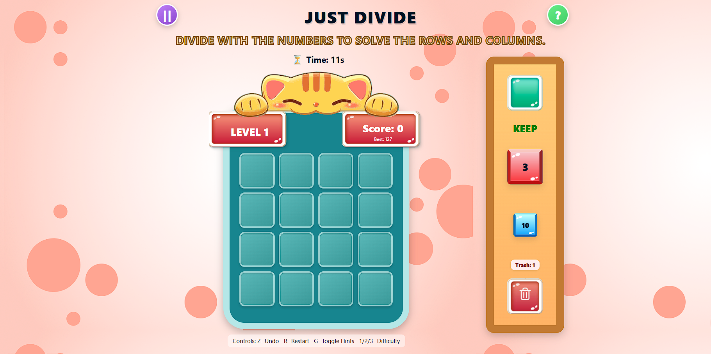

# Just Divide — Kid Mode

## Approach
Built a simple 4x4 number division puzzle with drag-and-drop using plain JavaScript and CSS.

## Decisions Made
Used divisibility merging for educational fun, minimal dependencies, and added "Keep" and "Trash" features for strategy.

## Challenges
Balancing difficulty, smooth drag-and-drop on all devices, and managing undo and scoring logic.

## Improvements
Add more levels, better graphics and sound, mobile-optimized UI, and cloud save support.

## Screenshot

